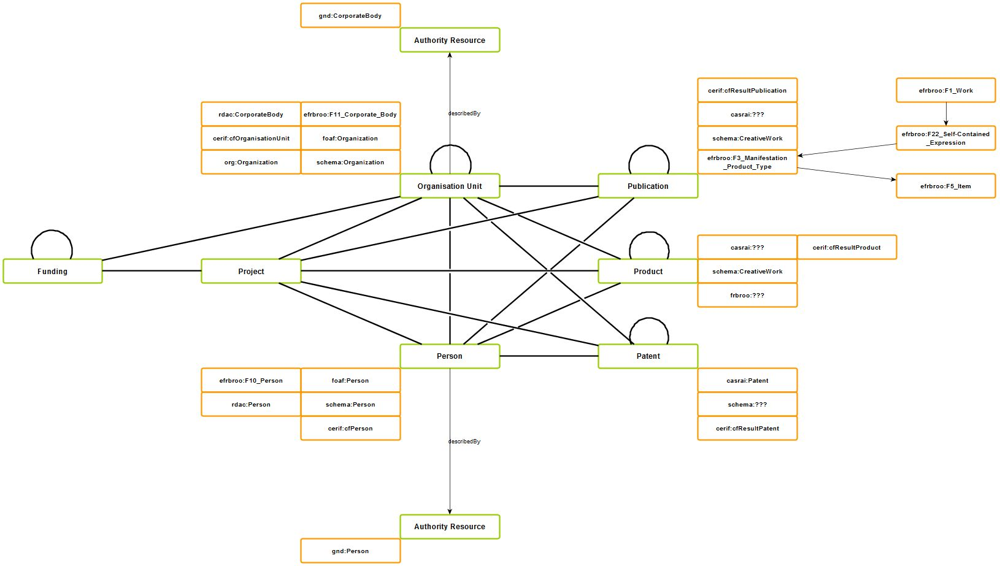

# hb_ng - Developing a new version of the bibliography... 

...

## Data model based on Linked Data principles

**Ziel:** 
Erarbeitung und Einsatz eines Datenmodells, in das sich die derzeit vorhandenen bibliographischen Metadaten sowie die Daten der Universitätsangehörigen und Organisationseinheiten der Universitäten integrieren lassen. Dieses Datenmodell wird zugleich so flexibel sein, dass auch in Zukunft weitere benötigte Kategorien (z.B. Projektangaben) eingebaut werden können. Der u.a. vom Wissenschaftsrat und von der DFG für Forschungsinformationssysteme (FIS) emfohlene Metadatenstand [CERIF](http://www.eurocris.org/Index.php?page=CERIFreleases&t=1) findet dabei Berücksichtigung. 

**Rahmenbedingungen:**

* Alle Entitäten bekommen eindeutige IDs (wird auch in Kerndatensatz Forschung des Wissenschaftsrates verlangt), z.B.
	* ORCiD für Personen
* Verwendung von Normdaten und kontrollierten Vokabularen, z.B.
	* Gemeinsame Normdatei (GND) für Personen und Organisationseinheiten, angestrebt auch für die verbale Sacherschließung

**Aktueller Stand:**

* Es wurde ein Entitätennetz auf Basis von CERIF definiert (model.graphml).
* Erste Entitäten wurden beschrieben. Dazu wurden *Application Profiles* definiert und geeignete Ontologien für die Beschreibung der Entitäten ausgewählt (siehe model.md).
* *Application Profiles:*
	* "simple" für einen schnellen Datenaustausch
	* "internal" für eine möglich umfassende Beschreibung der Entitäten
	* "schema" für die Anreicherung der Webseiten der Hochschulbibliographie mit schema.org-Vokabular
	* "cerif" für CERIF-kompatible Anwendungen
	* "kdsf" für den Kerndatensatz Forschung des Wissenschaftsrates
* Die Beschreibungen der Entitäten werden als Ressourcen betrachtet und selber mit Metadaten beschrieben. Dadurch entsteht die Möglichkeit neben Statusangaben zum Bearbeitungsstand auch Lizenzangaben zur Nachnutzung der Metadaten festzuhalten. 
* Es sind erste Mappings von den bestehenden Systemen in das neue Datenmodell erstellt worden (siehe auch model.md). 

**Bemerkung:**
* Die CERIF-Ontologie 1.3 ist in ihrer derzeitgen Form nahezu unbrauchbar! Das Problem ist, dass sämtliche Eigenschaften als "Classes" und keinerlei "Properties" modelliert sind (bspw. wird der Name einer Person so zu einer Klasse anstatt zu einer Eigenschaft einer Entität.). Folge: Wir verfolgen CERIF erstmal nur in der Form weiter, dass wir die Entitäten der Kernontologie verwenden, diese aber mittels "Ontology Allignments" und Relationen zu anderen Entitäten beschreiben.
* Eine Äquivalenz von der GND-Entität Person zu Person-Entitäten anderer  hier verwendeter Ontologien ist nicht möglich, da die GND-Entität Person von einer Klasse "Authority Resource" abgeleitet ist. Somit ist auch Person in diesem Kontext eine "Authority Resource". Zu dieser Problematik folgt später eine ausführliche Beschreibung.